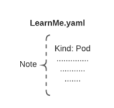
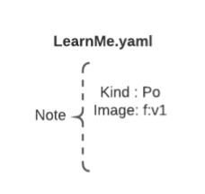
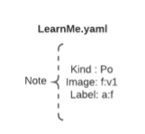
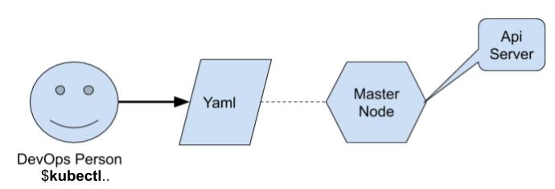

# Master ve Worker'lar nasıl iletişim kurar ? 
*Written by Kerem ÇELİKER*
- Twitter: **`@CloudRss`**
- Linkedin: **`linkedin.com/in/keremceliker`**
- Blog: **`www.keremceliker.com`**

**3 x Master Node** ve **3 x veya +N tane Worker Node'a** sahip oldugunu düşünün. 

Burada Worker Node'lar Cluster içerisinde bulunmaktadır. 

Master Node'un içerisinde birden fazla components bulunmaktadır. Örneğin **ETCD, kube-scheduler, kube-controller**  vb. bulunuyor. Bunların detayları için aşağıdaki adresi mutlaka ziyaret ederek, teknik prensiplerini öğrenmeniz gerekmektedir. 

**Ben burada Kube-Api-Server component'ini seçerek, hem Kubernetes içerisindeki iletişim mekanizması mantığının hemde deployment süreç'lerinin nasıl yapıldığı ile bu component'lerin süreci nasıl işlettirdiğini biraz daha farklı fakat anlaması akıcı bir yol ile aktarıyor olacağım.**

Api-Server component'i genel yapısı itibari ile hali hazırda bütün cluster içerisinde bir iletişim merkezi olarak görev almaktadır. En açık tabiri ile Dışarıdan gelen istekleri karşılamakta ve İçerideki Worker Node'lara dağıtmaktadır. 

Master Node içerisinde olduğu gibi, her bir Worker Node'un da içinde farklı component'ler bulunmaktadır. Bunların en önemlisi **Kubelet**'dir. 

Kubelet komponent'i en açık tabir ile Worker Node üzerinde çalışan Pod'larınızın sağlıklı bir şekilde çalışmasını sağlayan ve tüm Pod'ların da direk sorumlusu olan bir Kubernetes Agent'ıdır. 

Tüm Worker Node'ların üzerinde by default olarak Kubelet mutlaka bulunmaktadır. 

Bu arada Kubelet komponent'ini Master ile iletişimi de sağlayan bir diğer Merkez, component olarak da düşünmeniz oldukça yerinde bir düşünce olacaktır. 

Burada en başta paylaştığım gibi deployment süreç'lerinin nasıl yapıldığı ile bu core kubernetes component'lerin aralarında ki iletişim sürecini nasıl işlettirdiğini bir örnek ile açıklıyor olacağım. 
 

**Örnek;** 

 

**DevOps ve Developer** ekiplerinizin ayrı-ayrı olarak "Container" haline getirmiş olduğu **FrontEnd ve BackEnd**  Servislerinizin" olduğu ve çalıştığı bir uygulama olduğunu düşünebilirsiniz. 

Kubernetes üzerinde yeni bir Resource "Kaynak" oluşturabilmek için "Yaml" dosyalarını kullanırız. 

Bu aynı zamanda uygulamalarıda kurmak için da sıklıkla kullanılmaktadır. 

 
Peki bu "Yaml" dosyası nedir ?  Bu bir deklerasyon dosyasıdır. Bu deklerasyon dosyasına istediğimiz specification'ları belirtir ve bu spesifikasyonların da Kubernetes-Api-Server aracılığı ile Master Node'lara iletiriz, Master Node ise gerekli/erişilebilir olan veya sizin özellikle istediğiniz bir Worker Node üzerinde bu kaynağı ayağa kaldırır. 


**1.Öncelikle örnek olarak bir basit örnek ile "Yaml" yazarak şimdi FrontEnd-Deploy işlemi yapmayı düşünelim** 

 

**Dosya Adı: learnme.yaml**  => Bu bizim sözünü ettiğim Deklerasyon dosyamız. 

                                                    
LearnMe isimli Yaml dosyası yarattığınızda ilk zamanlar da basit ve kısa bileşenler ile başlar fakat zamanla müşteri ihtiyacınıza yada kurum yapınızın ihtiyaçlarına göre buna eklenen bazı kritik bileşenler de mutlaka olacaktır. 

 

Burada en başta bilmeniz gereken ve en önemli Yaml içerisinde kullanılan başlıca komponent'ler; 

 

**Kind:** ==> Bu Kubernetes Cluster içerisinde kaynak türünün yada Resource Type'ın ne olacağını belirtmek için kullanılır.  

 

**Örnek:** 

  
</p>


***Image ==> Her Pod by default olarak bir image'den mutlaka kalkması gerekmektedir. Bu yüzden tüm container haline getirmiş olduğumuz uygulamalarımızı Worker Node'lar üzerinde POD larak ayağa kaldırmak istiyorsak, onun üzerinde çalışacağı bir Image'a ihtiyaç duyarız. Mutlaka öncesinde bu Container'ın Image'ının en baştan uygulamanız için sorunsuz ve doğru çalıştığından emin olunması önem taşımaktadır. 

**Örnek:** 

 
</p>


```
**Kind: Pod 
***Image: f:v1  ( "f" frontend'i ve v1 ise version'u temsil etmektedir) 
```

Peki yukarıdaki tanımı Türkçe olarak çevirirsek bize ne demek istiyor ? 

Tip'i POD olan ve Image'ı da FrontEnd version 1 olan Image'ı kullanmak istiyorum. 

***Label: ==>  Bu "Label" bileşenini kaynaklarımıza ve kaynak türlerimizi tanımlamak amaçlı bir etiket gibi düşünebiliriz. POD türündeki Yaml File'ın aynı zamanda bir Label'a sahip olması da önerilmektedir. 

**Örnek: (Son Hali)**  

 
</p>

```
**Kind: Pod 
**Image: f:v1 
***Label: a:f (Application Frontend etiketini temsil etmektedir) 
```

Elimizde şuan artık hazır ve dolu bir Yaml file var. Şimdi bu örneği Deploy nasıl edeceğimize bakalım. 

**Örnek Senaryo:**  

X bir kurumda DevOps veya SRE rolünde bir çalışansınız. 

Sizden kubectl cli tool'u kullanarak => Master Node'da bulunan Kubernetes-Api-Server'a yani iletişim merkezine bu Yaml'ı göndermeniz isteniyor. Ne yaparsınız ? 

**Çözüm:** 

 
</p>

Kube-Api-Server Yaml içinde deklare ettiğimiz ve spesification'ları paylaşmış olduğunuz Resource Type'ını yani POD'u ilgili Worker Node üzerinde ayağa kaldıracaktır. 

Kube-Api-Server burada gerekli tanımlamaları Master Node üzerinde yaptıktan sonra "Worker Node" üzerinden Kubelet aracılığı ile kullanacağınız front-end v1 application'ınızı ayağa kaldıracaktır. Kubernetes üzerinden bu Pod'a otomatik olarak bir Internal-IP atanacaktır. Bu IP'ye yalnızca Kubernetes Cluster içerisinden erişilmektedir. 
 
Buradaki Pod'un Internal IP'sine diğer worker node'lardan diğer servisler certified SSH bağlantısı ile iletişim kurabilirler. 


**2.Sıra geldi Deployment Tipinde bir "Yaml" file oluşturmaya.**

 
Deployment yaptığınızda, Kubernetes cluster'ın içerisinde talep etmiş olduğunuz içerikteki desire state'i ayakta tutmaya çalışır.  

Kubernetes Desire-State ne demektir ?  

Bizim kubernetes'e deklere ettiğimiz ve arzuladığımız durum yada state'in adını tanımladığımız durumdur.  Bu state'e "Deployment" düzenli olarak Pod'larımızın sağlıklı mı yada erişilebilir mi oldugunu kontrol ederek eğer pod'larımız hizmet dışı kaldıysa, direk otomatik yeni bir Pod ayağa kaldırır. 

Şimdi bunu hazırlamak için yeni bir yaml oluşturalım bunun adı da **"LearnMeDeployment.yaml"** olsun. 

**Örnek:** 

```
- **Kind**:deployment (tipinde bir resource oluşturacağım) 
- Replicas: 3     (Oluşturulacak Resource'dan kaç tane ayakta kalmasını istiyorsun) 
- Template:       (Hangi template'i kullanarak ayağa kaldırmak istiyorsun) 
- Selector: {a:f} (Selector genellikle 2 tip farklılığı birbiri ile yada farklı bir noktaya set işlemi yapmak için kullanmaktayız.) 
```

Bu Deployment.yaml'ı biz K8s cluster'ımıza deploy ettiğimiz zaman, Deployment tipin de bir Resource oluşmuş olacak. 

 

Biraz daha açarsak, Application Frontend tipinde artık bir deployment'ınız var. Bu deployment daha öncesinde artık ölümlü olan Pod'larınızı yani hizmet dışı kalma ihtimali olan pod'larınızı ayakta tutacak desire state'e çekmek için sürekli olarak pod'ları kontrol edecektir. 

 

DevOps Person 

(KubeCtl) ===**Yaml.**==>  (Master) ==> (Api-Server)   

                                                                                     |==> a:f x 3  

 

Worker01 ==> f:v1 (Pod)  | Worker02 ==>  f:v1 (Pod) | Worker03 ==> f:v1 (Pod)   

 

 

Eğer yukarıdaki gibi WorkerNodes'larımızın içindeki bir Pod servis dışı kalacak olursa, örnekteki deployment ( a:f x 3) yeni bir pod yaratarak desire state'e (Running-State) yeniden yapıyı ulaştırmış olacaktır. 

 

Şuana kadar yaptığımız Yaml'lar bizim "Frontend-Application'ı" temsil etmektedir ve Bunu hazır etmiş olduk. 

 

 

**3.Şimdi sıra geldi sizden talep edilen diğer "Backend Service" için yaratmaya..**

 
Yukarıdaki örneklerdeki gibi bir deployment'ınızın oldugunu, backend servisimizin container haline getirildiğini ve kubectl aracılığı ile "b:v1" yaml file üzerinden pod ve a:b x 2 deployment tanımladığını düşünün. 

 

Bu sefer backend servisiniz ve backend deployment'ınız kubernetes cluster'ınız içinde desire state de olan 2 adet b:v1 pod oluşturacaktır. 

 

Bu hali ile aynı adımları bu senaryoya göre tanımladığınızda BackEnd-Service içinde POD'larınız ayaklanmış olacaktır. 

 

Şimdi elinizde hem Frontend hemde Backend Service olarak çalışan 2 ayrı POD yapısı bulunmakta ve Running desire-state'de çalışmaktadır.  

 

**Şuan akıldaki soru şu olmalı;** 

 

Bu POD'lar arasında nasıl bir iletişim içinde birbirleri ile haberleşiyorlar. 

 

O zaman Worker'lar içerisinde  bulunan Pod'larımızın ve Servislerimizin yani Backend ve Frontend servisimizin nasıl haberleştiğine bakalım. 

 

Frontend ve Backend Application'larımız Pod olarak hali hazırda artık zaten calısmaktadır. 

 

K8s cluster içerisinde bulunan pod'lar belirli sebeblerden dolayı doğal olarak zaman-zaman hizmet dışı kalabiliyorlar. Eğer bir pod'unuz hizmet dışı kalırsa Deployment yeniden oluşturduğunda Internal Ip'si de değişecektir. Bu durumda Backend Servisi üzerinden ==> Frontend Servisi üzerine istek atılması gerektiği zaman ulaşılması ve iletişim kurulması gerektiğinde (Çoğunlukla böyle olacaktır) Backend Servisiniz, IP adresi değişen Frontend servisine ulaşamayacaktır. 

 

Buradaki fazlasıyla Dynamic bir yapı çalışmaktadır ve şimdi herkesin aklında bunu daha basit haliyle Static'e çekmenin bir yolu var mı ? sorusu mutlaka oluşacaktır.. 

 

Evet, bu işlemi pratik bir yol ile sağlayabilirsiniz. Servisler arasındaki iletişimin kesintiye uğramaması için "Servis Tipinde" bir kaynak tanımlamamız yeterli olacaktır. 

 

Daha anlaşılır hali ile belirtmek gerekirse Kubernetes ortamında bir servis tanımlamak için "Kind" ı Service olan bir Yaml oluşturabilirsiniz. 

 **LearnMeService.yaml**

**Örnek:**


**Kind: service 

**Selector: { a:f} 

 

Şimdi burada Servis'in kullandığımız Deployment'ı da görmesi gerek olacağı için bunun için de Yaml file içinde Service altına da Selector eklemeniz ve kullanmanız gerekmektedir. Selector genellikle 2 tip farklılığı birbiri ile yada farklı bir noktaya set işlemi yapmak için kullanmaktayız. 

 

Yukarıda oluşturduğunuz bir servis Application Frontend deployment'ının ilgili ve sorumlu olduğu ; f:v1 x 3 Pod'larının tamamına ayrılmış bir layer'dan geçirecek ve tanımlamasını da biz servis olarak isimlendireceğiz. 

 

**Örnek:**

 

Worker01 ==> f:v1 (Pod)  | Worker02 ==>  f:v1 (Pod) | Worker03 ==> f:v1 (Pod)   

                     Svc-f  ==> Cluster IP (IP'si Cluster IP olan bir servis) 

 

Aynı durumun Backend içinde olduğunu düşünebilirsiniz. Yani backend tipinde bir servis tanımladığınızı düşünebilirsiniz. 

 

                   ==> b:v1 (Pod)  | Worker02 ==>  b:v1 (Pod) | Worker03 ==> b:v1 (Pod)   

                     Svc-b ==> Cluster IP (IP'si Cluster IP olan bir servis) 

               

Son durumda 2 adet Servis'imiz bulunmaktadır. 


Eğer Backend Pod'unuz sizin Frontend Servisinize bir istek atmak isterse **"svc_f"**  kullanarak ilgili pod'lardan herhangi birine erişebilir.Aynı işlemin tersi Frontend içinde geçerli olacaktır **"svc_b"** servis tanımı ile. 


Buradaki Servis yapısı ile daha sağlıklı ve stabil bir haberleşme motud'u kurulmuş olundu. 

 

 

**4.Application'a External'dan erişim;**

 

Son olarak ise burada çalışan tüm uygulamalarımıza eğer Cluster dışından, Client'larımız yada Mobil Apps kullanıcılarınnız ulaşmak isterse, cluster içerisinde tanımlamış olduğumuz Internal Ip'ler geçerli olmayacaktır. 

 

Bu durumda sizlerin External IP adresi tanımlamanız gerekmektedir. 

 

External IP'leri tanımlayabilmek için de Mevcut da çalışan Servis tipinizin Load-Balancer yada Node-Port olarak dışarıya açılması Expose edilmesi gerekmektedir. 

 

**Örnek:**

 

Bir cep tel kullanıcısı MobileApps'e erişmek isterse: 

 

**User ==>  type: loadbalancer** olan bir servis tipiyle External olan bir IP ile cluster'ın içerisinde yer alan uygulamanıza erişim sağlayacaklardır. 

 

 

 

 

 

 

 

 

 

 

 

 

 

 

 

 

 

 

 

 

 

 

 

 

 

 

 

 

 
